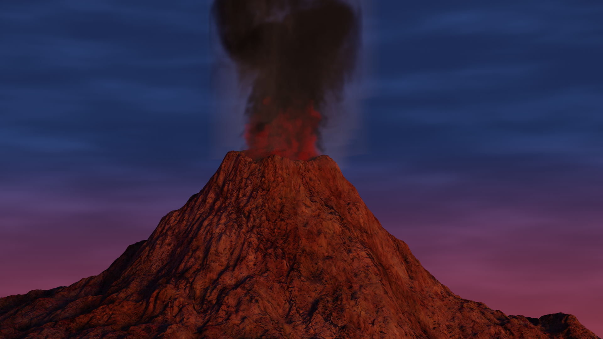
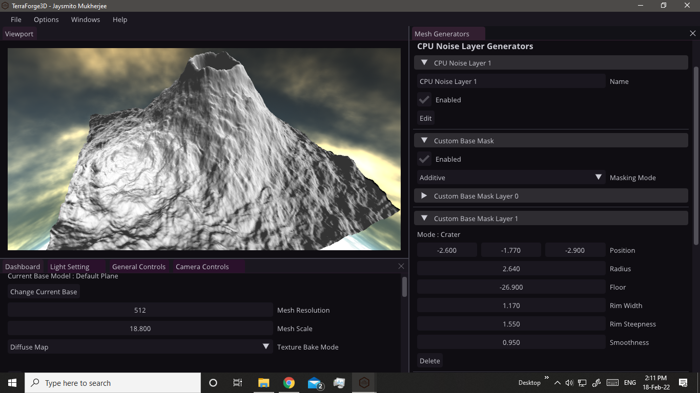
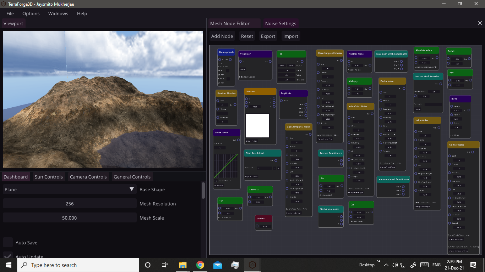

 

    </

 

  
  
  
     
  
  
  
     
    
    

 

# TerraForge3D

TerraForge3D is a powerful cross platform procedural terrain generation and texturing tool. This is being maintained actively. This has got everything you need to bring your imagination to life.

A huge benefit is that TerraForge3D is 100% free and opensource. TerraForge3D is very easy to get started with. There are also a series of tutorials(on youtube), documentations for your help.

Also if you have any question or problem or suggestion you can directly reach out to me via my email jaysmito101@gmail.com . 
Or you could join out official discord server with a charming community(including me) to help you out with anny issues.

## Discord Server : https://discord.gg/9ebyYwSktZ

# Showcase

Here are some of the terrains created with TerraForge3D. (You can send your artwork either via the discord server or https://github.com/Jaysmito101/TerraForge3D/issues/10)

  
  
  
  
  

For more visit : https://jaysmito101.github.io/TerraForge3D/

# Screenshots

Here are some of the screenshots of the application with all its ui, ...

  
  
  
  
  
  

### A Request

Please consider Giving your valuable feedback : https://github.com/Jaysmito101/TerraForge3D/discussions/6

Also Please consider <b>starring</b> this repository.

Also if possible please considering supporting the project through patreon or opencollective it helps a lot.

## Tutorials : <a href="https://www.youtube.com/playlist?list=PLl3xhxX__M4A74aaTj8fvqApu7vo3cOiZ">Youtube</a>

# Features

TerraForge3D has got a series of features. Listing all of them is a very difficult task. Here are some of the major features.

### GPU Powered Terrain Generation

TerraForge3D utilizes the power of your GPU to generate the terrains blazing fast. TerraForge3D utilizes OpenCL 2.0 to use your GPU. With GPU mesh generation you can work with extremely huge meshs in realtime.

### CPU Powered Terrain Generation

There are somethings which cannot possible be done on a GPU as efficiently(like the node editor) so you can optionally mix GPU generation with CPU generation to get more control. Also if you GPU doesnt support OpenCL 2.0 you can still use the CPU mesh Generation. Also TerraForge's CPU Mesh Generation algorithms are made keeping efficiency and speed in mind thus they are extremely fast.

### No Limit on Resolution

Most terrain generation applications limit you to a certain maximum resolution or only certain resolutions like (128, 256, ...) but not TerraForge3D! TerraForge3D Allows you to work with any resolution you can imagine of.

### Dedicated Texture Baker

Bake any node output, the heightmap, anything you want to a high quality texture! Bake a huge resulution texture at once or bake it in tiles!

### Shader Nodes

Like Blender, TerraForge3D has a shader node editor which lets you texture your terrain exactly how you want, exactly how you imagined it. You can also export the shader node setup into functional GLSL code for your own project!

### Cross Platform

One of the biggest benefits of Terraforge3D is that its cross platform! Also TerraForge3D is the only high end Procedural generator supported on linux!

### Physically Based Renderer

Preview your terrains in photo realistic quality!

### Advanced Node Editor

TerraForge3D has a very advanced Node Editor with 40+ different nodes which let you completely control how the terrain is generated. You can even use mathematical functions to shape your terrain!

### Physically Based Erosion

TerraForge3D has several erosion algorithms(hydraulic, wind, ...) which lets you simulate the simulation on you procedurally generated terrains giving it an extra touch of realism. These algorithms simulate actual rain, wind, dust to give the best effect.

### Custom Shape Generation

Procedural is great! But sometimes there must be a human touch! Thus TerraForge3D lets you customize your terrain by pmanyally placing terrrain features like hills, caters, cliffs, etc and combine it with procedural terrain.

### Custom Sky

TerraForge3D allows you to completely customize the sky. You can use a sky box, sky dome. You can procedurally generate a sky or use a HDRI.

### Sea Level Visualization

TerraForge3D also lets you visualize a sea to give you a idea of the sea level.

### Custom Shaders

TerraForge3D allows you to have a custom shader(in GLSL). TerraForge3D also provides a inbuilt editor for writing your shaders!

### Texture Store & Texture Settings

TerraForge3D gives you a huge collection of textures to download and use free of cost! Also TerraForge3D's texture settings give you fine control over how the mesh is textured.

### Universal

TerraForge3D can export to a whole lot of 3D file formats like OBJ, GLTF, GLB, STL, ... . Also you can export heightmaps as PNG, JPG, ... . This makes TerraForge3D totally compitable with any program you can think of! Be it Blender, Unreal Engine, Uniy, Maya, anything.

# Some Advices

* When you are stating up the app for first time it will need to download some things and cache them you can see the console for deails
* You can Show/Hide the console from Menu > Options > Toggle System Console.
* Whenever you feel that something is wrong or the app is slow check the console for updates

# Contributing

Since this project has become very large I would really love some help.
For a guide on how to get started developing TerraForge3D https://terraforge3d.gitbook.io/docs/developers-guide

# Support

Any support is highly appretiated!
Please considering tweeting about this to spread the word and help this project grow.
You could join my patreon and get early access to TerraForge3D builds, some great terrain files, many more things (<a href="https://patreon.com/jaysmito101">Patreon</a>)

## Download TerraForge3D : https://github.com/Jaysmito101/TerraForge3D/releases/tag/v2.3

Give your valuable feedback : https://github.com/Jaysmito101/TerraGen3D/discussions/6

Tutorials : <a href="https://www.youtube.com/playlist?list=PLl3xhxX__M4A74aaTj8fvqApu7vo3cOiZ">Youtube</a>

Join the Discord Server : https://discord.gg/AcgRafSfyB

# Docs : https://jaysmito101.github.io/TerraForge3D/documentation/index.html

